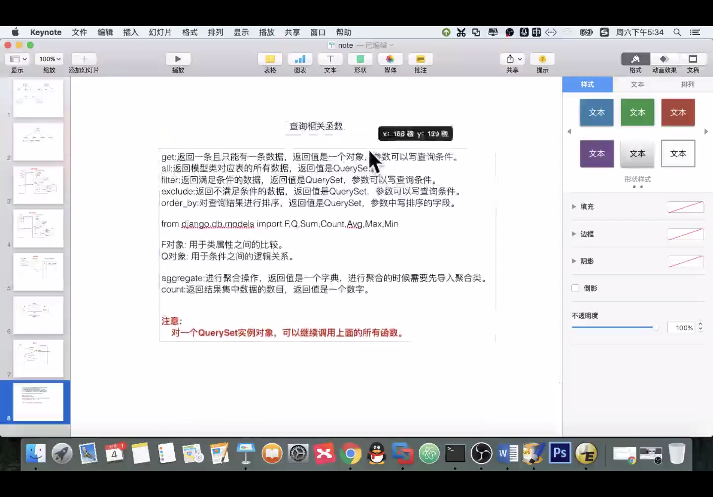
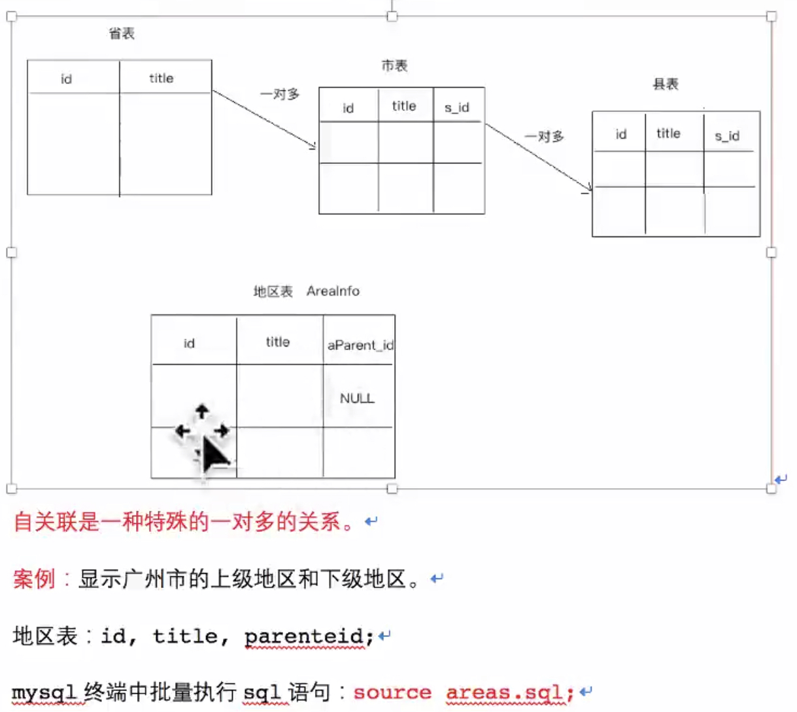

# Django

Django学习

## Test  
Markdown  

    注意点1:  
    配置网站地址 统一加 /  
    
    1. /creat
    这种网址是: 域名 + 路径
    
    2. create
    这种是 当前页面的路径 拼接 creat,当出现 / 的时候 会出问题
    
    urls.py配置 末尾统一加 '/' 
    html中 地址开头统一用 '/create'这样的就行了
    一头一尾

# 数据库

django选项(models.py 导入的models包内)  
DecimalField() 比FloatField()精确 FloatField  
存入取出可能有差异涉及金钱等需要精确的用DecimalField
    

- auto_now_add = true 参数: 默认赋值为当前时间,记录创建时间  

例如:
```python
DateField(auto_now_add = true) 
```
- auto_now = true 参数: 默认赋值为当前时间,记录更新时间  
(修改了此对象的任何数据都要更新时间) 
```python
DateField(auto_now = true)
```
注:
- 两者不能同时使用  
    
- TimeField(小时分秒)  
DateTimeField(年月日时分秒)   
参数同上
    

## 查询语句:

[模型类.objects.方法](https://blog.csdn.net/chen1042246612/article/details/84071006)

### 方法

    get:返回一条且只能一条--数据为空或者多于一个,django抛出异常
    all:返回所有  
    filter:返回满足条件的  
    exclude:返回不满足的  
    order_by:对查询结果排序  
#### 方法使用 
查询方法使用格式: 模块类属性名__条件名=值  
​    
1.等于:exact

```python
BookInfo.objects.get(id__exact=1)  
```

简写:  
```python
BookInfo.objects.get(id=1)
```

2.模糊查询  
包含关键词:  contains  endswith  startwith 

- 查询包含 传 的书名
``` python
BookInfo.objecrts.filter(btitle__contain='传') 
```

- 查询以传结尾的书名
```python
BookInfo.objecrts.filter(btitle__endswith='传') 
```

- 查询以传开头的书名
```python
BookInfo.objecrts.filter(btitle__startwith='传')  
```

3.空查询  

- 查询不为空的书名

```python
BookInfo.objecrts.filter(btitle__isnull=False) 
```

4.范围查询  

查询 id 为1或3或5的书

```python
BookInfo.objecrts.filter(id__in=[1,3,5])
```


5.比较查询  
gt(great than)  
lt(less than)   
gte(great than equal) 大于等于  
lte(less than equal) 小于等于  

- 查询 id 大于3的书  

```python
BookInfo.objecrts.filter(id__gt=3) 
```
- 查询 id 小于等于4的书  

```python
BookInfo.objecrts.filter(id__lte=3) 
```
6.日期查询: 模块类属性名__条件名=值  

- 查询年: 模块类属性名__year=值 year可换为 month day

```
BookInfo.objecrts.filter(bpub_date__year=1980) 
```
- 查询 日期等于1980年的书?  

```
BookInfo.objecrts.filter(bpub_date__gt=date(1980,1,1)) 
```
- 查询大于1980.1.1的书籍 要导入date函数  

7.exclude: 返回不满足条件的

- 返回id不等于1的

```
BookInfo.objects.exclude(id=1)
```


8.order_by  

- 升序排列 = 从小到大(可以加多个排序条件): 

```python
BookInfo.objects.all().order_by('id','title') 
```
- 降序排列: 变为 -id 即为降序 (DESC)

```python
BookInfo.objects.all().order_by('-id')
```


- 查询所有的有简单写法:(省略 .all() )   

```
BookInfo.objects.order_by('id')   
```

#### 多个条件查询  
##### Q对象: 与或非 & | ~
作用:查询条件之间的逻辑关系  not and or  

导入包

```python
from djang.db.models import Q  
```

1.且关系

- 查id大于3且阅读量大于30   

```
BookInfo.objects.filter(id__gt=3,bread__gt=30)  
```

```
BookInfo.objects.filter(Q(id__gt=3)&Q(bread__gt=30))   
```
两者一样,方法二为简写,优先用上面那个

2.或关系

```
BookInfo.objects.filter( Q(id__gt=3) | Q(bread__gt=30) )
```

- 查询id不等于3  

```
BookInfo.objects.filter( ~Q(id=3) ) 
```
波浪号表示相反


##### F对象:属性之间比较  

``` python
from djang.db.models import F 
```
- 阅读量大于评论量  

```
BookInfo.objects.filter(bread__gt=F('bcomment'))  
```
- 阅读量大于2倍评论量图书信息  

```
BookInfo.objects.filter(bread__gt=F('bcomment')*2)  
```

##### 聚合函数
aggregate:调用它使用聚合,返回`字典`

```
from django.db.models import Sum,Count,Max,Min,Avg
```
1.查询用户总数


```
BookInfo.objects.all().aggregate(Count('id)) 
```

```
BookInfo.objects.aggregate(Count('id')) 
```
.all()可以省略  
返回值为 {'id_count':5}  为字典

2.总和
- 查询阅读总量
``` python
BookInfo.objects.aggregate(Sum('bread'))
```
Count() count函数返回数字,其余aggregate(例如这里面的Count)返回字典   

3.count() 函数使用

- 直接调用count函数  
>注意:  
>count函数返回数值  
>aggregate(Count(''))返回QuerySet

``` python
BookInfo.objects.filter(id__gt=3).count()
```

## 查询函数总结




# 关联属性
1. 一对多:在多的那个定义外键  
2. 多对多:哪一边定义都可以  
3. 一对一:哪一边定义都可以  

我要做的项目是一对一模式还是一对多?

# 11.关联查询(一对多)

- 查询id为1的英雄的信息(class BookInfo 和 class HeroInfo 已经关联属性)

```python
b = BookInfo.objects.get(id=1)
b.heroinfo_set.all()
```

##通过模型类实现关联查询
- 查询图书信息,要求图书关联的英雄的描述包含'八'  
前提:(class BookInfo 和 class HeroInfo 已经关联属性)  
```python
BookInfo.objects.fliter(heroinfo__hcomment__contains='八') 
```
- 查询图书信息,要求图书中的英雄id大于三
```python
BookInfo.objects.filter(heroinfo__id__gt=3) (id前面是两个下划线? 是的)
```
- 查询书名为天龙八部的所有英雄
```python
BookInfo.objects.fllter(hbook__btitle='天龙八部')
```
比较第三个和前两个  
如果前面有对应查询的类名,参数里面直接写属性名(第三个,hbook__btitle='天龙八部').  
如果没,先要写类名(第一二个,heroinfo__hcomment__contains='八')  

- 查询 id为1的英雄 关联的图书信息  
```python
BookInfo.objects.filter(heroinfo__id=1)
```
返回QuerySet(查询集) 

第二种方法:  
```python
b = HeroInfo.objects.get(id=1)
b.hbook
```
b.hbook返回对象

总结:
1. 通过模型类实现关联查询时,要查哪个表中的数据,就需要通过哪个类来查
2. 写关联查询条件时,如果类中没有关系属性,条件要写对应的关系属性,如果有,直接写关系属性

## 插入 更新 删除
- 调用模型类对象的save() 实现数据表中的插入和更新  
- 调用----------delete()------------删除  

### 自关联

自关联 = 特殊的一对多关系,这些一对多的关系在一张表里面(表四)


### 出错排查
-  TypeError: __init__() missing 1 required positional argument: 'on_delete'  
描述:执行出错
```
python manage.py makemigrations
```
外键选项加上:
on_delete=models.CASCADE  
[详细解决方法](https://blog.csdn.net/yjk13703623757/article/details/79452968)


 


  


 


​        
​        
​    
​    
​      
