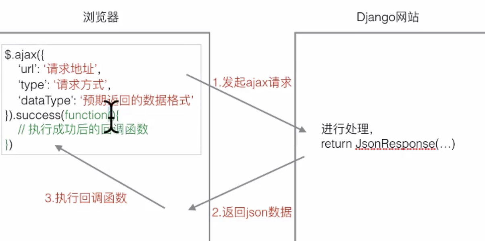
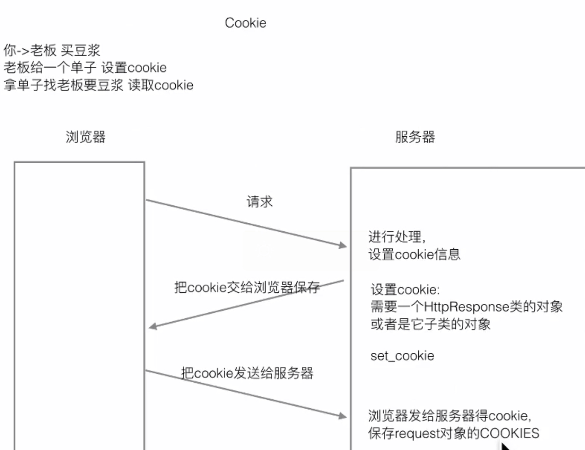

# Django

Django学习

[视频地址](https://www.bilibili.com/video/BV1Tx411d7E7/?p=29&t=285)

## md使用 
Markdown  

    注意点1:  
    配置网站地址 统一加 /  
    
    1. /creat
    这种网址是: 域名 + 路径
    
    2. create
    这种是 当前页面的路径 拼接 creat,当出现 / 的时候 会出问题
    
    urls.py配置 末尾统一加 '/' 
    html中 地址开头统一用 '/create'这样的就行了
    一头一尾


## 新建项目并配置
[新建项目配置视频](https://www.bilibili.com/video/BV1Tx411d7E7/?p=29&t=285)
# 数据库

django选项(models.py 导入的models包内)  
DecimalField() 比FloatField()精确 FloatField  
存入取出可能有差异涉及金钱等需要精确的用DecimalField
    

- auto_now_add = true 参数: 默认赋值为当前时间,记录创建时间  

例如:
```python
DateField(auto_now_add = true) 
```
- auto_now = true 参数: 默认赋值为当前时间,记录更新时间  
(修改了此对象的任何数据都要更新时间) 
```python
DateField(auto_now = true)
```
注:
- 两者不能同时使用  
    
- TimeField(小时分秒)  
DateTimeField(年月日时分秒)   
参数同上
    

## 查询语句:

[模型类.objects.方法](https://blog.csdn.net/chen1042246612/article/details/84071006)

### 方法

    get:返回一条且只能一条--数据为空或者多于一个,django抛出异常
    all:返回所有  
    filter:返回满足条件的  
    exclude:返回不满足的  
    order_by:对查询结果排序  
#### 方法使用 
查询方法使用格式: 模块类属性名__条件名=值  
​    
1.等于:exact

```python
BookInfo.objects.get(id__exact=1)  
```

简写:  
```python
BookInfo.objects.get(id=1)
```

2.模糊查询  
包含关键词:  contains  endswith  startwith 

- 查询包含 传 的书名
``` python
BookInfo.objecrts.filter(btitle__contain='传') 
```

- 查询以传结尾的书名
```python
BookInfo.objecrts.filter(btitle__endswith='传') 
```

- 查询以传开头的书名
```python
BookInfo.objecrts.filter(btitle__startwith='传')  
```

3.空查询  

- 查询不为空的书名

```python
BookInfo.objecrts.filter(btitle__isnull=False) 
```

4.范围查询  

查询 id 为1或3或5的书

```python
BookInfo.objecrts.filter(id__in=[1,3,5])
```


5.比较查询  
gt(great than)  
lt(less than)   
gte(great than equal) 大于等于  
lte(less than equal) 小于等于  

- 查询 id 大于3的书  

```python
BookInfo.objecrts.filter(id__gt=3) 
```
- 查询 id 小于等于4的书  

```python
BookInfo.objecrts.filter(id__lte=3) 
```
6.日期查询: 模块类属性名__条件名=值  

- 查询年: 模块类属性名__year=值 year可换为 month day

```
BookInfo.objecrts.filter(bpub_date__year=1980) 
```
- 查询 日期等于1980年的书?  

```
BookInfo.objecrts.filter(bpub_date__gt=date(1980,1,1)) 
```
- 查询大于1980.1.1的书籍 要导入date函数  

7.exclude: 返回不满足条件的

- 返回id不等于1的

```
BookInfo.objects.exclude(id=1)
```


8.order_by  

- 升序排列 = 从小到大(可以加多个排序条件): 

```python
BookInfo.objects.all().order_by('id','title') 
```
- 降序排列: 变为 -id 即为降序 (DESC)

```python
BookInfo.objects.all().order_by('-id')
```


- 查询所有的有简单写法:(省略 .all() )   

```
BookInfo.objects.order_by('id')   
```

#### 多个条件查询  
##### Q对象: 与或非 & | ~
作用:查询条件之间的逻辑关系  not and or  

导入包

```python
from djang.db.models import Q  
```

1.且关系

- 查id大于3且阅读量大于30   

```
BookInfo.objects.filter(id__gt=3,bread__gt=30)  
```

```
BookInfo.objects.filter(Q(id__gt=3)&Q(bread__gt=30))   
```
两者一样,方法二为简写,优先用上面那个

2.或关系

```
BookInfo.objects.filter( Q(id__gt=3) | Q(bread__gt=30) )
```

- 查询id不等于3  

```
BookInfo.objects.filter( ~Q(id=3) ) 
```
波浪号表示相反


##### F对象:属性之间比较  

``` python
from djang.db.models import F 
```
- 阅读量大于评论量  

```
BookInfo.objects.filter(bread__gt=F('bcomment'))  
```
- 阅读量大于2倍评论量图书信息  

```
BookInfo.objects.filter(bread__gt=F('bcomment')*2)  
```

##### 聚合函数
aggregate:调用它使用聚合,返回`字典`

```
from django.db.models import Sum,Count,Max,Min,Avg
```
1.查询用户总数


```
BookInfo.objects.all().aggregate(Count('id)) 
```

```
BookInfo.objects.aggregate(Count('id')) 
```
.all()可以省略  
返回值为 {'id_count':5}  为字典

2.总和
- 查询阅读总量
``` python
BookInfo.objects.aggregate(Sum('bread'))
```
Count() count函数返回数字,其余aggregate(例如这里面的Count)返回字典   

3.count() 函数使用

- 直接调用count函数  
>注意:  
>count函数返回数值  
>aggregate(Count(''))返回QuerySet

``` python
BookInfo.objects.filter(id__gt=3).count()
```

## 查询函数总结


## 关联属性
1. 一对多:在多的那个定义外键  
2. 多对多:哪一边定义都可以  
3. 一对一:哪一边定义都可以  

我要做的项目是一对一模式还是一对多?

## 11.关联查询(一对多)

- 查询id为1的英雄的信息(class BookInfo 和 class HeroInfo 已经关联属性)

```python
b = BookInfo.objects.get(id=1)
b.heroinfo_set.all()
```

##通过模型类实现关联查询
- 查询图书信息,要求图书关联的英雄的描述包含'八'  
前提:(class BookInfo 和 class HeroInfo 已经关联属性)  
```python
BookInfo.objects.fliter(heroinfo__hcomment__contains='八') 
```
- 查询图书信息,要求图书中的英雄id大于三
```python
BookInfo.objects.filter(heroinfo__id__gt=3) (id前面是两个下划线? 是的)
```
- 查询书名为天龙八部的所有英雄
```python
BookInfo.objects.fllter(hbook__btitle='天龙八部')
```
比较第三个和前两个  
如果前面有对应查询的类名,参数里面直接写属性名(第三个,hbook__btitle='天龙八部').  
如果没,先要写类名(第一二个,heroinfo__hcomment__contains='八')  

- 查询 id为1的英雄 关联的图书信息  
```python
BookInfo.objects.filter(heroinfo__id=1)
```
返回QuerySet(查询集) 

第二种方法:  
```python
b = HeroInfo.objects.get(id=1)
b.hbook
```
b.hbook返回对象

总结:
1. 通过模型类实现关联查询时,要查哪个表中的数据,就需要通过哪个类来查
2. 写关联查询条件时,如果类中没有关系属性,条件要写对应的关系属性,如果有,直接写关系属性

## 插入 更新 删除
- 调用模型类对象的save() 实现数据表中的插入和更新  
- 调用----------delete()------------删除  

### 自关联

自关联 = 特殊的一对多关系,这些一对多的关系在一张表里面(表四)

## 模型管理类自定义

- 用途:  
1. 改变查询结果集  
调用此命令,返回没有删除的图书的数据:
 ```python
BookInfo.objects.all()
```
位于models.py下
```python
class BookInfoManage(models.Manager):  # 自定义管理类
        #     1.改变查询结果集
    def all(self):
        #         调用父类all方法 获取所有
        books = super().all()  # 查询集合
        #     对数据进行过滤
        books = books.filter(isDelete=False)
        return books
```
2. 添加额外的方法

models.py 中 class BookInfo(models.Model)下,增加一个保存图书的方法
问:@classmethod什么意思?
```python
    @classmethod
    def creat_book(cls,btitle,bpub_date):
        obj = cls()
        obj.btitle = btitle
        obj.bpub_date = bpub_date
    #     保存
        obj.save()
        return obj
```
但是一般定义在模型类里,一般定义在模型类管理器里面
models.py 中 class BookInfoManage(models.Manager)
```python
class BookInfoManage(models.Manager):  # 自定义管理类
        #     1.改变查询结果集
    def all(self):
        #         调用父类all方法 获取所有
        books = super().all()  # 查询集合
        #     对数据进行过滤
        books = books.filter(isDelete=False)
        return books
        
    # 2.封装函数:操作模型类对应的数据表(增删改查)
    def create_book(self, btitle, bpub_date):
        # creat book对象
        book = BookInfo()
        book.btitle = btitle
        book.bpub_date = bpub_date
        # 保存
        book.save()
        # 返回book
        return book
```
实际上django已经封装好了这个方法
调用:(传参必须通过关键字参数传)
```python
BookInfo.objects.create(btitle='test3',bpubdate='1990-10-10')
```

- 为了方便维护代码:
```python
    def create_book(self, btitle, bpub_date):
        #获取self所在模型类
        model_class = self.model
        # creat book对象
        book = model_class()
        # book = BookInfo() #这个就不用了
        book.btitle = btitle
        book.bpub_date = bpub_date
        # 保存
        book.save()
        # 返回book
        return book
```

- 元选项
1. 指定数据表表名
使用:在类定义中加入
```python
    # 指定数据表表名
    class Meta:
        db_table = '表名'
```

表名可改变,其他不能改变
实例:  
```python
class BookInfo(models.Model):  # 必须继承于model.Model才行
    """图书模型类"""
    # 图书名称 CharField 说明是字符串 max_length指定字符串最大长度
    btitle = models.CharField(max_length=20)
    # 图书出版日期 DateField日期类型
    bpub_date = models.DateField()
    # 阅读量
    bread = models.IntegerField(default=0)
    # 评论量
    bcomment = models.IntegerField(default=0)
    # 删除标记 不做真正的删除 软删除
    isDelete = models.BooleanField(default=False)
    # 加这个可以使用BookInfo.object. 不加不行
    objects = BookInfoManage()  # 管理类 自定义

    # 指定数据表表名
    class Meta:
        db_table = '表名'
```

# 视图

## 错误:
- 404排错:url未配置或者配置错误
- 500排错:视图出错  

##  捕获url参数(视频p31)
概述:进行url匹配时,把需要捕获的部分设置橙一个`正则表达式组`,
django会把匹配到的内容作为参数传递给视图函数
- 位置参数:参数名可以任意指定

- 关键字参数:在位置参数的基础上给正则表达式组命名即可  
    ?p<组名>
    关键字参数,视图中参数名必须和正则表达式组名一致
    
    
- QueryDict
取值方法:  
1.q['a'] --字典法
2.q.get('a')
个人觉得2方法简单点,而且get方法取如果  
没有这个值会返回none,而第一种会报错

方法2:可以设置默认值 q.get('d', 'default'')  
如果d无值,则使用我自己设定的default默认值  

QueryDict可以存多个参数

```python
q1 = QueryDict('a=1&a=2&b=2')
```
获取最后一个a的值
```python
q1.get('a)
```

获取a对应的列表
``` python
q1.getlist('a')
```

- request的方法:  
GET POST PATH 

## ajax:异步JavaScript



1. ajax不要返回页面或者重定向,因ajax始终在后台

## Cookie
描述: 服务器生成并存储,浏览器也存储cookie,服务器请求网站带上cookie信息,就免登录了


## Session
 
- 设置session:
```python
request.session['username']='zx'
```

- 读取session
```python
request.session['username']
```

### session方法
```python
request.session.clear()
```

```python
request.session.flush()
```
```python
del request.session['键']
```

设置session_id cookie过期时间  
- value = 整数: 在value秒后没有活动会过期
- value = 0  : 浏览器关闭时过期
- value = None : 两周后过期
```python
request.session.set_expiry(value)
```


# 出错解决记录
##  TypeError: __init__() missing 1 required positional argument: 'on_delete'  
描述:执行出错
```python
python manage.py makemigrations
```
外键选项加上:
on_delete=models.CASCADE  
[详细解决方法](https://blog.csdn.net/yjk13703623757/article/details/79452968)

## objects选项没提示
解决: 在models.py类文件中加入
```python
objects = models.Manager()
```

## 用的python3,编译器提示python2错误
[解决办法:关闭兼容性检测:Inspections-->python-->Code compatibility Inspection-->取消勾选2,7版本](https://intellij-support.jetbrains.com/hc/en-us/community/posts/360000027564-pyCharm-writes-python-version-2-7-doesn-t-have-module-pathlib-while-project-interpreter-is-set-to-3-5-2-mac-os-high-sierra-)

## # HttpResponse()里面的参数拼接需要用加号,不能用逗号
- 正确写法
```python
return HttpResponse('获取session:'+username+':'+str(age))

```

- 错误写法
```python
return HttpResponse('获取session:',username,':',str(age))
```


 


  


 


​        
​        
​    
​    
​      
